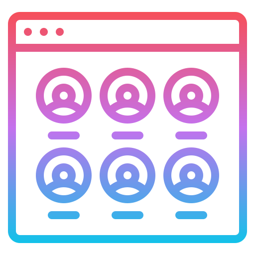

# Module 12 Challenge: Team Page Generator
Assignment 12 of the [Front-End Web Dev bootcamp][bootcamp-url] to create a team page.

****

<!-- PROJECT LOGO -->
 

<!-- Webpage icon -->

<h1 align="center">Team Page Generator</h1>

  
A Node-based app to dynamically create an html page for a team based on user inputs from command line.

   
   

<!-- TABLE OF CONTENTS -->

  
Table of Contents

  <ol>
    <li>
      <a href="#about-the-project">About The Project</a>
      <ul>
        <li><a href="#project-goal">Project Goal</a></li>
        li><a href="#sample-project-image">Sample Project Image</a></li>
        <li><a href="#built-with">Built With</a></li>
      </ul>
    </li>
    <li><a href="#development">Development</a></li>
    <li><a href="#deployed-project">Deployed Project</a></li>
  </ol>

<!-- ABOUT THE PROJECT -->
## About The Project

### Project Goal
The goal of this project is to apply principles of Object-Oriented Programming and Test-Driven Development, and to practice working with Node.js (specifically the inquirer and fs packages) and Jest.js to create an app that dynamically generates an html page based on CLI inputs.

### Sample Project Image

We were provided with a sample image of how the generated html file can look in the browser (the styling is optional):

![sample image][sample-image]

### Built With

We were provided with some starter code in JavaScript and html, which I further updated.

The project was built with:

[![HTML][html-badge]][html-url] 
[![CSS][css-badge]][css-url] 
[![Bootstrap][boostrap-badge]][bootstrap-url]
[![JavaScript][js-badge]][js-url]
[![Node.js][node-badge]][node-url]
[![Inquirer.js][inquirer-badge]][inquirer-url]
[![Jest.js][jest-badge]][jest-url]

(<a href="#readme-top">back to top</a>)

<!-- The build process -->
## Development

The development of this project required applying the principles of **Test-Driven Development**: _Red -> Green -> Refactor_. 

That meant to write the test files first, then writing JavaScrip code that fails the tests, improving the code so that it passes the tests, and then refactoring the code to make it clean and dry.

(<a href="#readme-top">back to top</a>)

<!-- Deployed project -->
## Deployed project

The generated html file looks like this:

![team page][html-image]

This repository contains the JavaScript files, the test files and the final output html file:

- [ ] [Project repo][repo-url]

(<a href="#readme-top">back to top</a>)

#### Credit:

    
Attribution

- <a href="https://www.flaticon.com/free-icons/team" title="team icons">Team icons created by iconixar - Flaticon</a>

<!-- MARKDOWN LINKS & IMAGES -->
[repo-url]: https://github.com/icollier77/team-page-app
[html-badge]: https://img.shields.io/badge/HTML-e34c26?style=for-the-badge&logo=html5&logoColor=white
[css-badge]: https://img.shields.io/badge/CSS-FF8A27?style=for-the-badge&logo=CSS3
[js-badge]: https://img.shields.io/badge/JavaScript-F0DB4F?style=for-the-badge&logo=Javascript&logoColor=323330
[node-badge]: https://img.shields.io/badge/Node.js-%233c873a?style=for-the-badge&logo=node.js&logoColor=white
[jest-badge]: https://img.shields.io/badge/Jest-%23C63D14?style=for-the-badge&logo=Jest&logoColor=white
[inquirer-badge]: https://img.shields.io/badge/Inquirer-yellow?style=for-the-badge&logo=Inquirer&logoColor=white
[boostrap-badge]: https://img.shields.io/badge/Bootstrap-563D7C?style=for-the-badge&logo=bootstrap&logoColor=white
[html-url]: https://www.w3schools.com/html/
[css-url]: https://www.w3schools.com/css/default.asp
[js-url]: https://www.w3schools.com/js/default.asp
[node-url]: https://nodejs.org/en
[jest-url]: https://jestjs.io/
[inquirer-url]: https://www.npmjs.com/package/inquirer
[bootstrap-url]: https://getbootstrap.com/
[bootcamp-url]: https://www.edx.org/boot-camps/coding/skills-bootcamp-in-front-end-web-development
[html-image]: ./images/html-screenshot.png
[sample-image]: ./instructions/14-object-oriented-programming-challenge-demo.png